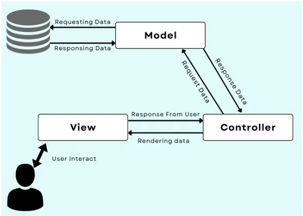
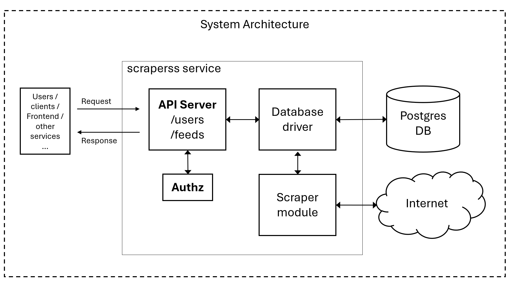

# scraperss
A backend service for collecting posts from multiple RSS feeds. The application runs as a service and exposes RESTful API for managing users and their desired RSS feeds. The service periodically scrapes the configured RSS feeds and collects posts/articles posted on those feeds.

> Disclaimer: This is a pet project as part of my learning journey to build scalable, extendable, performant applications in Go. Some parts of the application idea and implementation approach are inspired from [this Go course](https://youtu.be/un6ZyFkqFKo?si=DhQIgWVBHRb4IuXj) that I have done. 

# Features
Salient features of the application are the following, which are further elaborated using user stories and sample use cases for the service.
- **Fetching RSS feeds**: The service supports mutiple users, and supports configuring multiple RSS feeds per user. Posts from those RSS feeds are collected periodically and saved in the database. These posts can be fetched by the users via the API.
- **User management**: users can be created, updated and deleted via corresponding API operations.
- **Authorized access**: RSS feeds and collected posts are linked with users and can only be accessed by the respective users. API keys are used to ensure authorization over applicable API endpoints and operations. 
- **Feeds management**: RSS feeds can be configured by CRUD operations via the API.
- **Relational database**: The service makes use of Postgres database to store users, feeds, and collected posts.

## Example use cases
### Single user
**Personal Website:** An example of a 'single user' use case for this service can be found in a user's personal website. Blogs, articles and other news items from different sources (that support exposing RSS feeds) can be accumulated in a specific section of user's personal website as desired.  

### Multi user
**Platform for Job Seekers:** An online service providing a platform for job seekers can enable its users to aggregate their blogposts, articles, publications etc. from different in one place, to boost up their profiles for potential employers.

## User stories
1. A frontend service wants to register the users with this backend service by creating respective user profiles (user objects), so that feeds can be configured with assocaited users.  
2. As an authorized user, I want to configure the list of desired RSS feeds, so that the service can periodically check them, fetch items from them, store them, and make them available on demand.

# Software Architecture
The software architecutre pattern of scraperss service resembles the Model-View-Controller pattern with the omission of the 'View' part, which can be thought of as an external component, e.g., a web UI generated by a frontend service. 

*Figure from this useful [Medium Article](https://medium.com/@the_nick_morgan/what-are-the-10-most-common-software-architecture-patterns-faa4b26e8808)*

The overall system architecture is illustrated below, showcasing relevant modules and components that are internal and external to the scraperss service.

*System Architecture*

# API Structure & Resources 
The API endpoints, supported HTTP methods over those endpoints, and main functionality and characteritics of those endpoints are listed in the following table.

| Method | API endpoint | Authorization | Scope| Functionality |
| --- | --- | --- | --- | --- |
| POST | /users | unauthorized | Admin | creates a new user and generates a unique private key for the user |
| GET | /users | unauthorized | Admin | returns the list of all users |
| GET | /users/{userID} | unauthorized | Admin | returns an individual user whose ID is provided, useful to get the IDs for deleting select users |
| DELETE | /users/{userID} | unauthorized | Admin | deletes a created user, along with their configured RSS feeds and posts from the database |
| POST | /feeds | authorized (using API Key) | Users | Users can access this endpoint using their API key in the Authorization header `ApiKey <value>` to create a new feed, which is linked to their user account |
| GET | /feeds | authorized (using API Key) | Users | returns the list of all the feeds created by a user |
| DELETE | /feeds/{feedID} | authorized (using API Key) | Users | deletes a particular feed, along with the collected posts from that feed |

Below are the formats for POST requests used for creating users and feeds over their respective endpoints:

To create a user, send in the JSON in the POST request body as follows:
```
{
	"name": "Test User"
}
```

To create a feed for a user, use the following format in the POST request:
```
{
    "name": "Feed Name"
    "url": "<complete-url-for-the-feed>"
}
```
 
# Usage
## Pre-requisites
- Golang v1.24.0: The scraperss service is built in Go version v1.24.0 and requires Go toolchain to build it from source. 
- PostgreSQL 17: Additionally, the service's data layer makes use of Postgres 17 as application's database.
- goose package for managing Postgres migrations

## DB Setup
You will need a database migration tool to set up the required tables in Postgres. [`goose`](https://github.com/pressly/goose) can be used for this purpose. Once goose is installed, run the following in the `./sql/schema` directory:
```
goose postgres postgres://postgres@localhost:5432/<db_name> up 
```
Do not add the disable ssl flag in the DB_URL.

## Configuration
The application requires two configuration parameters to be provided as environment variables in a `.env` file. The application code will automatically retrieve these parameters from the .env file.
- PORT: the port over which the HTTP server listens for requests, e.g., 8080
- DB_URL: URL of postgres DB to which the service will connect, e.g., postgres://postgres@localhost:5432/<db_name>?sslmode=disable

## Build and run
To build the application, run the following in the root directory:
```
go build
```
The above command will generate an executable file named as `scraperss.exe`. Run that executable in your terminal (Powershell or Linux terminal) like `.\scraperss.exe` in case of Windows or `./scraperss.exe` in case of Linux. 


# Repository structure and files
## Main Package
The main package contains the following key components:
- **main.go**: serves as the main entry point of the application, reads environment config, initiates concurrent scraping, routes HTTP requests to appropriate handler funcs and implements the server.
- **handler_users.go**: contains handler functions for incoming HTTP requests on the /users endpoint, e.g., create user, get users, delete user etc.
- **handler_feeds.go**: contains handler functions for incomiung HTTP requests on the /feeds endpoint, e.g., creating a feed, deleting a feed etc.
- **middleware_authz.go**: implements authorization logic for the authorized endpoints of the API. Ensures authorization of incoming requests by checking the API key in the Authorization header and verifying if a user exists for that API key, before redirecting the request to an appropriate handler function for further processing.
- **json.go**: contains functions for writing error and json responses on the HTTP response writer. 
- **models.go**: translate DB objects to structs with appropriate json keys that can be sent in response messages.
- **rss.go**: defines structs for items recieved on an RSS feed and a function to get RSS feeds from their URLs.
- **scrape.go**: implements functions to get feeds from the DB that need fetching and then scrapes each individual feed for its items in a concurrent fashion using go routines.

## Internal Packages
### Auth
The internal auth package contains the following component:
- **auth.go**:  extracts the API key from the Authorization header of incoming request.
### Database
The internal database package has been generated using the [`sqlc` tool](https://docs.sqlc.dev/en/latest/) for the queries in the [queries folder](./sql/queries), and contains the following components:
- **db.go**: boilerplate code for running SQL queries on the database tables.
- **models.go**: contains models for the database objects, e.g., user, feed, etc.
- **users.sql.go**: contains methods to run queries on the users table.
- **feeds.sql.go**: contains methods to run queries on the feeds table.

## DB Schema
Schema for the database tables used by this service can be seen in the [schema folder](./sql/schema).

## Tests
The file `main_test.go` contains basic tests for some API endpoints of the scraperss service. To run the tests, run the following command in the root directory when the service is up and running:
```
go test -v
``` 
Update the URLs for API endpoints, defined as `const`s in the file, as per your setup's configuration.
